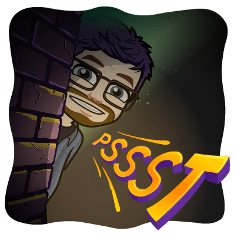

## Images

| Image | Preview |
| --- | --- |
| [`100-100-100.png`](./100-100-100.png) |  |
| [`accurate.png`](./accurate.png) |  |
| [`agreed.png`](./agreed.png) |  |
| [`amazing.png`](./amazing.png) |  |
| [`approved.png`](./approved.png) |  |
| [`aww-yeahh.png`](./aww-yeahh.png) |  |
| [`balloons.png`](./balloons.png) |  |
| [`big-mood.png`](./big-mood.png) |  |
| [`bravo.png`](./bravo.png) |  |
| [`bueno.png`](./bueno.png) |  |
| [`car-with-dog.png`](./car-with-dog.png) |  |
| [`charts.png`](./charts.png) |  |
| [`check-books.png`](./check-books.png) |  |
| [`check-thumbs.png`](./check-thumbs.png) |  |
| [`cheer.png`](./cheer.png) |  |
| [`clutch.png`](./clutch.png) |  |
| [`count-me-in.png`](./count-me-in.png) |  |
| [`darn-tootin.png`](./darn-tootin.png) |  |
| [`deal-with-it.png`](./deal-with-it.png) |  |
| [`denied.png`](./denied.png) |  |
| [`disco.png`](./disco.png) |  |
| [`do-it.png`](./do-it.png) |  |
| [`done-and-done.png`](./done-and-done.png) |  |
| [`dream-team.png`](./dream-team.png) |  |
| [`dumpster-fire.png`](./dumpster-fire.png) |  |
| [`easy-peasy.png`](./easy-peasy.png) |  |
| [`error.png`](./error.png) |  |
| [`evil-laughter.png`](./evil-laughter.png) |  |
| [`excellent-devious.png`](./excellent-devious.png) |  |
| [`excellent.png`](./excellent.png) |  |
| [`finally.png`](./finally.png) |  |
| [`fire.png`](./fire.png) |  |
| [`first-down.png`](./first-down.png) |  |
| [`fist-bump.png`](./fist-bump.png) |  |
| [`genius.png`](./genius.png) |  |
| [`gold-star.png`](./gold-star.png) |  |
| [`good-call.png`](./good-call.png) |  |
| [`good-idea.png`](./good-idea.png) |  |
| [`good-job.png`](./good-job.png) |  |
| [`good-news.png`](./good-news.png) |  |
| [`great-idea.png`](./great-idea.png) |  |
| [`green-light.png`](./green-light.png) |  |
| [`high-five.png`](./high-five.png) |  |
| [`hip-hip-hurray.png`](./hip-hip-hurray.png) |  |
| [`hype.png`](./hype.png) |  |
| [`i-helped.png`](./i-helped.png) |  |
| [`i-know-you-read-that.png`](./i-know-you-read-that.png) |  |
| [`im-lost.png`](./im-lost.png) |  |
| [`it-is-what-it-is.png`](./it-is-what-it-is.png) |  |
| [`jetpack.png`](./jetpack.png) |  |
| [`killin-it.png`](./killin-it.png) |  |
| [`legends-only.png`](./legends-only.png) |  |
| [`lets-do-this.png`](./lets-do-this.png) |  |
| [`lets-get-this-bread.png`](./lets-get-this-bread.png) |  |
| [`lets-go.png`](./lets-go.png) |  |
| [`lets-taco-bout-it.png`](./lets-taco-bout-it.png) |  |
| [`love-to-see-it.png`](./love-to-see-it.png) |  |
| [`make-it-rain.png`](./make-it-rain.png) |  |
| [`many-thanks.png`](./many-thanks.png) |  |
| [`math.png`](./math.png) |  |
| [`mind-blown.png`](./mind-blown.png) |  |
| [`mistake.png`](./mistake.png) |  |
| [`money.png`](./money.png) |  |
| [`mvp.png`](./mvp.png) |  |
| [`nailed-it.png`](./nailed-it.png) |  |
| [`nice-work.png`](./nice-work.png) |  |
| [`no-one-can-stop-us-now.png`](./no-one-can-stop-us-now.png) |  |
| [`no-time.png`](./no-time.png) |  |
| [`noted.png`](./noted.png) |  |
| [`oh-yeah.png`](./oh-yeah.png) |  |
| [`ok.png`](./ok.png) |  |
| [`out-of-office.png`](./out-of-office.png) |  |
| [`perfect.png`](./perfect.png) |  |
| [`pls-and-thx.png`](./pls-and-thx.png) |  |
| [`pssst.png`](./pssst.png) |  |
| [`put-a-pin.png`](./put-a-pin.png) |  |
| [`quality-content.png`](./quality-content.png) |  |
| [`respect.png`](./respect.png) |  |
| [`right-on.png`](./right-on.png) |  |
| [`rock-on.png`](./rock-on.png) |  |
| [`seal-clap.png`](./seal-clap.png) |  |
| [`self-awareness.png`](./self-awareness.png) |  |
| [`ship-it.png`](./ship-it.png) |  |
| [`shrug.png`](./shrug.png) |  |
| [`shut-up.png`](./shut-up.png) |  |
| [`sign-me-up.png`](./sign-me-up.png) |  |
| [`smart.png`](./smart.png) |  |
| [`solid.png`](./solid.png) |  |
| [`solved.png`](./solved.png) |  |
| [`sos.png`](./sos.png) |  |
| [`spike-football.png`](./spike-football.png) |  |
| [`spying-in-grass.png`](./spying-in-grass.png) |  |
| [`spying-through-blinds.png`](./spying-through-blinds.png) |  |
| [`squad.png`](./squad.png) |  |
| [`stickers.png`](./stickers.png) |  |
| [`surprise.png`](./surprise.png) |  |
| [`team-awesome.png`](./team-awesome.png) |  |
| [`thanks-a-bunch.png`](./thanks-a-bunch.png) |  |
| [`thanks.png`](./thanks.png) |  |
| [`thinking.png`](./thinking.png) |  |
| [`thumbs-up.png`](./thumbs-up.png) |  |
| [`trophy-unlocked.png`](./trophy-unlocked.png) |  |
| [`true-dat.png`](./true-dat.png) |  |
| [`true-story.png`](./true-story.png) |  |
| [`tux.png`](./tux.png) |  |
| [`unicorn.png`](./unicorn.png) |  |
| [`very-good.png`](./very-good.png) |  |
| [`want.png`](./want.png) |  |
| [`way-to-go.png`](./way-to-go.png) |  |
| [`we-made-it.png`](./we-made-it.png) |  |
| [`well-done.png`](./well-done.png) |  |
| [`well-played.png`](./well-played.png) |  |
| [`word.png`](./word.png) |  |
| [`wowow.png`](./wowow.png) |  |
| [`yes.png`](./yes.png) |  |
| [`yo.png`](./yo.png) |  |
| [`you-da-best.png`](./you-da-best.png) |  |
| [`you-did-the-thing.png`](./you-did-the-thing.png) |  |
| [`you-got-it.png`](./you-got-it.png) |  |
| [`you-got-this.png`](./you-got-this.png) |  |
| [`you-rock.png`](./you-rock.png) |  |
| [`youre-not-wrong.png`](./youre-not-wrong.png) |  |
